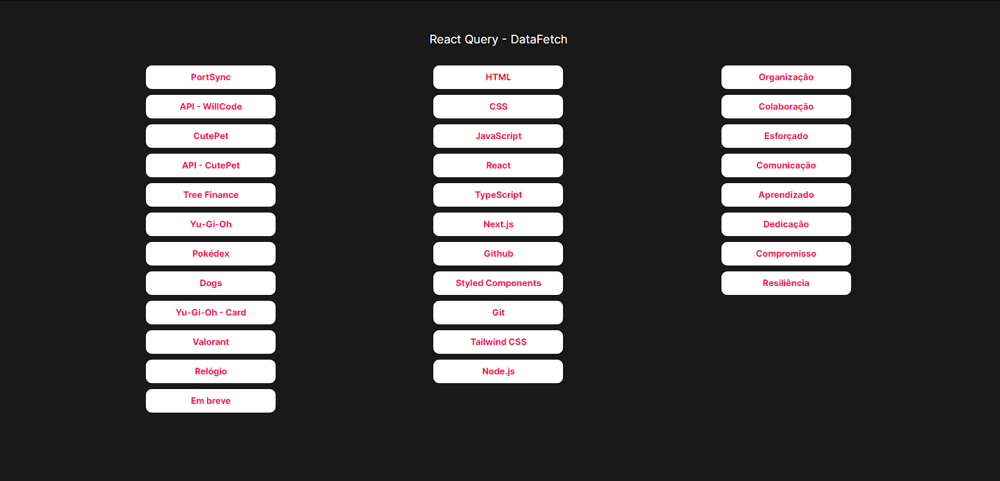
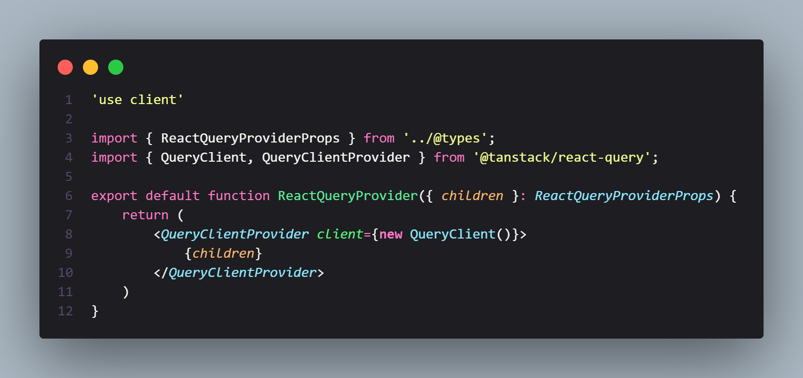
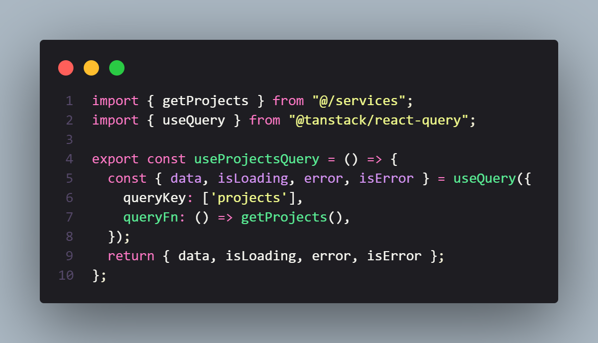
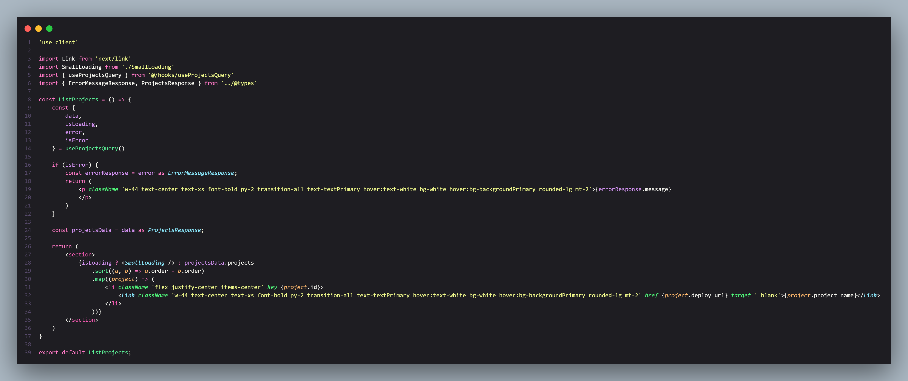

## Descrição

### Pequeno projeto implementando os conceitos básicos do uso do [react-query](https://tanstack.com/query/latest/docs/react/overview), uma poderosa biblioteca para gerenciamento assíncrono de estado em TypeScript/JavaScript, React, Solid, Vue e Svelte.

### Neste projeto, estou realizando requisições GET da minha própria API, e para tornar o código mais organizado e reutilizável, criei hooks customizados que encapsulam a lógica de consulta para as diferentes chamadas de API. Esses hooks permitem que eu utilize facilmente a funcionalidade de consulta em diferentes componentes, evitando repetição de código e garantindo que as chamadas sejam tratadas de forma consistente em toda a aplicação.

### O [react-query](https://tanstack.com/query/latest/docs/react/overview) é uma ferramenta poderosa que simplifica a interação com APIs assíncronas, melhorando a experiência de desenvolvimento e tornando a implementação de funcionalidades como paginção, refetching automático e cache de dados mais fácil e eficiente. Com a combinação do [react-query](https://tanstack.com/query/latest/docs/react/overview) e os hooks personalizados criados neste projeto, tenho uma abordagem mais robusta e eficiente para lidar com o estado assíncrono em minha aplicação React, permitindo uma experiência de usuário mais fluida e responsiva.

[Ver Projeto](https://dynamic-routers.vercel.app/)

#

## Layout web
#

#

#

#

 

## 🛠️ Tecnologias

💻 **Front-end**
- [Next.js 13.4](https://nextjs.org)
- [Typescript](https://www.typescriptlang.org)

📚 **Bibliotecas**
- [react-query](https://tanstack.com/query/latest/docs/react/overview)

🎨 **Estilização**
- [tailwindcss](https://tailwindcss.com/docs/installation)

🔋 **Versionamento e Deploy**
- [Git](https://git-scm.com)
- [Vercel](https://vercel.com/)

 

⚙️ **Configuranções e Instalações**

Clone do Projeto

    $ git clone https://github.com/renovatt/react-query-basic.git
Instalando as dependências

    $ npm install

Iniciando o projeto

    $ npm run dev

 

**Como contribuir?**

- Você pode dar suporte me seguindo aqui no GitHub
- Dando uma estrela no projeto
- Criar uma conexão comigo no linkedin fazendo parte da minha networking e curtir o meu projeto.

 

**Autor**
[Wildemberg Renovato de Lima](https://www.linkedin.com/in/renovatt/)